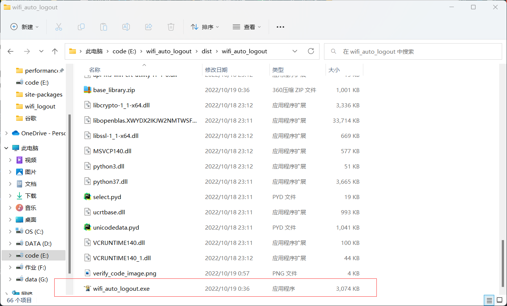
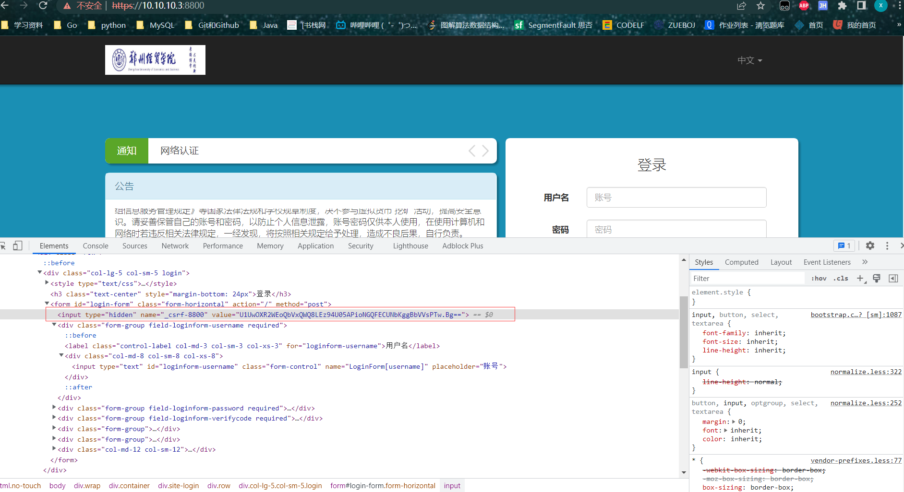

# zuebWifiLogout
郑州经贸学院校园网自动下线脚本

## 声明
该项目仅供为学习使用，若不正当的使用，产生的后果一概与本人无关。


## 使用的模块
- requests
- ddddocr
- pyinsterall

## 使用教程
1. 将代码克隆到本地
    `git clone `
2. 打开`dist`文件夹，找到`wifi_auto_logout.exe`文件

3. 直接运行`wifi_auto_logout.exe`文件，在弹出的终端页面中按照提示输入自己的学号和密码就可以了。
运行结束之后会自动退出终端，目前暂不知支持退出已连接校园网的设备后自动登录。

4. 可以将`dist`文件夹，中的`wifi_auto_logout.exe`发送桌面快捷方式，这样可以方便我们操作。


## 实现详细流程:
1.获取`_csrf-8800`  
首先使用`get`请求`https://10.10.10.3:8800/`页面获取该页面中隐藏的`_csrf-8800`,这个值在登录的时候需要用到。  
  

2.验证码识别    
这里我使用的是`ddddocr`包，这个包在打包的时候有一个大坑o(╥﹏╥)o  
   验证码识别代码:
```
      import ddddocr

      def get_image_code(filename):
       print('进入获取验证码函数')
       time.sleep(5)
       ocr = ddddocr.DdddOcr()
       try:
           with open(filename, 'rb') as f:
               img_bytes = f.read()
       except:
           print('打开文件失败')
       verify_code = ocr.classification(img_bytes)
       print('验证码为：', verify_code)
       time.sleep(5)
       return verify_code  
```
3.登录网站  
使用`post`请求`https://10.10.10.3:8800/`:  
需要传递的参数如下:  
```python
        data = {
            '_csrf-8800': self.token,
            'LoginForm[username]': self.username,
            'LoginForm[password]': self.password,
            'LoginForm[verifyCode]': self.verify_code(),
            'login-button': '',
        }
```
4.退出已经在线的设备
使用`post`请求`https://10.10.10.3:8800/home/onekey`:  
需要传递的参数如下:(其实就是第一步获取的`_csrf-8800`的值:)
```python
    data = {
                '_csrf-8800': self.token,
            }
```


## 总结:
写这个爬虫时遇到的两个问题
1. 获取隐藏值时，自己的解决问题，当时自己只会`requests`库的基本请求，根据自己的想法，内心只有一句话
模仿人是怎么请求，最后经过分析解决了该问题（这个问题还好，手动狗头）。  

2. 打包之前在自己的电脑上执行，是完全ok，但是一打包完执行，就直接挂掉，最终发现是`ddddocr`的问题
这个BUG卡了好几天，是因为将其打包为单一exe可执行文件时，`ddddocr`包不能被打包到该可执行文件中（自己的看法）
最终只能打包为一个包含所有文件的包中。


